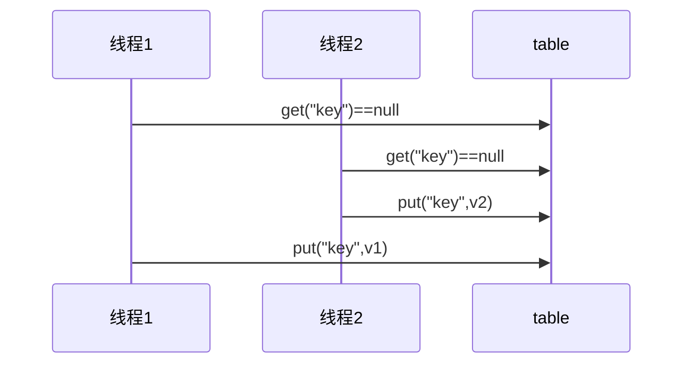

### 4.共享模型之管程

####  4.1 共享带来的问题

##### 小故事【P51】

##### Java的体现

两个线程对初始值为 0 的静态变量一个做自增，一个做自减，各做 5000 次，结果是 0 吗？

```
static int counter = 0;
 
public static void main(String[] args) throws InterruptedException {
    Thread t1 = new Thread(() -> {
        for (int i = 0; i < 5000; i++) {
            counter++;
        }
    }, "t1");
 
    Thread t2 = new Thread(() -> {
        for (int i = 0; i < 5000; i++) {
            counter--;
        }
    }, "t2");
 
    t1.start();
    t2.start();
    t1.join();
    t2.join();
    log.debug("{}",counter);
}
```

##### 问题分析

以上的结果可能是正数、负数、零。为什么呢？因为 Java 中对静态变量的自增，自减**并不是原子操作**，要彻底理解，必须从字节码来进行分析

例如对于 i++ 而言（i 为静态变量），实际会产生如下的 JVM 字节码指令：

```
getstatic     i  // 获取静态变量i的值
iconst_1         // 准备常量1
iadd             // 自增
putstatic     i  // 将修改后的值存入静态变量i
```

而对应 i-- 也是类似：

```
getstatic     i  // 获取静态变量i的值
iconst_1         // 准备常量1
isub             // 自减
putstatic     i  // 将修改后的值存入静态变量i
```

而 Java 的内存模型如下，完成静态变量的自增，自减需要在主存和工作内存中进行数据交换：


如果是单线程以上 8 行代码是顺序执行（不会交错）没有问题：


但多线程下这 8 行代码可能交错运行：
出现负数的情况：


出现正数的情况：


##### 临界区 Critical Section

- 一个程序运行多个线程本身是没有问题的
- 问题出在多个线程访问共享资源
  - 多个线程读共享资源其实也没有问题
  - 在多个线程对共享资源读写操作时发生指令交错，就会出现问题
- 一段代码块内如果存在对共享资源的多线程读写操作，称这段代码块为临界区

例如，下面代码中的临界区

```
static int counter = 0;
 
static void increment() 
// 临界区
{    
    counter++;
}
 
static void decrement() 
// 临界区
{    
    counter--;
}
```

##### 竞态条件 Race Condition

多个线程在临界区内执行，由于代码的**执行序列不同**而导致结果无法预测，称之为发生了**竞态条件**

#### 4.2 synchronized解决方案

##### 应用之互斥

为了避免临界区的竞态条件发生，有多种手段可以达到目的。

- 阻塞式的解决方案：synchronized，Lock

- 非阻塞式的解决方案：原子变量

本次课使用阻塞式的解决方案：synchronized，来解决上述问题，即俗称的【对象锁】，它采用互斥的方式让同一时刻至多只有一个线程能持有【对象锁】，其它线程再想获取这个【对象锁】时就会阻塞住。这样就能保证拥有锁的线程可以安全的执行临界区内的代码，不用担心线程上下文切换

>注意
>
>虽然 java 中互斥和同步都可以采用 synchronized 关键字来完成，但它们还是有区别的：
>
>- 互斥是保证临界区的竞态条件发生，同一时刻只能有一个线程执行临界区代码
>- 同步是由于线程执行的先后、顺序不同、需要一个线程等待其它线程运行到某个点

##### synchronized

语法：

```
synchronized(对象) // 线程1， 线程2(blocked)
{
    临界区
}
```

解决

```
static int counter = 0;
static final Object room = new Object();
 
public static void main(String[] args) throws InterruptedException {
    Thread t1 = new Thread(() -> {
        for (int i = 0; i < 5000; i++) {
            synchronized (room) {
                counter++;
            }
        }
    }, "t1");
 
    Thread t2 = new Thread(() -> {
        for (int i = 0; i < 5000; i++) {
            synchronized (room) {
                counter--;
            }
        }
    }, "t2");
 
    t1.start();
    t2.start();
    t1.join();
    t2.join();
    log.debug("{}",counter);
}
```


你可以做这样的类比：

- synchronized(对象) 中的对象，可以想象为一个房间（room），有唯一入口（门）房间只能一次进入一人进行计算，线程 t1，t2 想象成两个人
- 当线程 t1 执行到 synchronized(room) 时就好比 t1 进入了这个房间，并锁住了门拿走了钥匙，在门内执行 count++ 代码
- 这时候如果 t2 也运行到了 synchronized(room) 时，它发现门被锁住了，只能在门外等待，发生了上下文切换，阻塞住了
- 这中间即使 t1 的 cpu 时间片不幸用完，被踢出了门外（不要错误理解为锁住了对象就能一直执行下去哦），这时门还是锁住的，t1 仍拿着钥匙，t2 线程还在阻塞状态进不来，只有下次轮到 t1 自己再次获得时间片时才能开门进入
- 当 t1 执行完 synchronized{} 块内的代码，这时候才会从 obj 房间出来并解开门上的锁，唤醒 t2 线程把钥匙给他。t2 线程这时才可以进入 obj 房间，锁住了门拿上钥匙，执行它的 count-- 代码

用图来表示


##### 思考

synchronized 实际是用**对象锁**保证了**临界区内代码的原子性**，临界区内的代码对外是不可分割的，不会被线程切换所打断。

为了加深理解，请思考下面的问题

- 如果把 synchronized(obj) 放在 for 循环的外面，如何理解？-- 原子性
- 如果 t1 synchronized(obj1) 而 t2 synchronized(obj2) 会怎样运作？-- 锁对象  要锁同一个对象
- 如果 t1 synchronized(obj) 而 t2 没有加会怎么样？如何理解？-- 锁对象  都要加锁

##### 面向对象改进

把需要保护的共享变量放入一个类

```
class Room {
    int value = 0;
 
    public void increment() {
        synchronized (this) {
            value++;
        }
    }
 
    public void decrement() {
        synchronized (this) {
            value--;
        }
    }
 
    public int get() {
        synchronized (this) {
            return value;
        }
    }
}
 
@Slf4j
public class Test1 {
    
    public static void main(String[] args) throws InterruptedException {
        Room room = new Room();
        Thread t1 = new Thread(() -> {
            for (int j = 0; j < 5000; j++) {
                room.increment();
                 }
        }, "t1");
 
        Thread t2 = new Thread(() -> {
            for (int j = 0; j < 5000; j++) {
                room.decrement();
            }
        }, "t2");
        t1.start();
        t2.start();
 
        t1.join();
        t2.join();
        log.debug("count: {}" , room.get());
    }
}
```

#### 4.3 方法上的synchronized

```
class Test{
    public synchronized void test() {
    
    }
}
等价于
class Test{
    public void test() {
        synchronized(this) {
        
        }
    }
}
```

并不是说锁了方法，synchronized只能锁对象，这样相当于锁了this对象

```
class Test{
    public synchronized static void test() {
 
    }
}
等价于
class Test{
    public static void test() {
        synchronized(Test.class) {
            
        }
    }
}
```

##### 不加synchronized的方法

不加synchronized的方法就好比不遵守规则的人，不去老实排队（好比翻窗户进去的）

##### 所谓的“线程八锁”


#### 4.4 变量的线程安全分析

##### 成员变量和静态变量是否线程安全？

- 如果它们没有共享，则线程安全
- 如果它们被共享了，根据它们的状态是否能够改变，又分两种情况
  - 如果只有读操作，则线程安全
  - 如果有读写操作，则这段代码是临界区，需要考虑线程安全

##### 局部变量是否线程安全？

- 局部变量是线程安全的
- 但局部变量引用的对象则未必
  - 如果该对象没有逃离方法的作用访问，它是线程安全的
  - 如果该对象逃离方法的作用范围，需要考虑线程安全

##### 局部变量线程安全问题

```
public static void test1() {
    int i = 10;
    i++;
}
```

每个线程调用 test1() 方法时局部变量 i，会在每个线程的栈帧内存中被创建多份，因此不存在共享

```
public static void test1();
    descriptor: ()V
    flags: ACC_PUBLIC, ACC_STATIC
    Code:
      stack=1, locals=1, args_size=0
         0: bipush        10
         2: istore_0
         3: iinc          0, 1
         6: return
      LineNumberTable:
        line 10: 0
        line 11: 3
        line 12: 6
      LocalVariableTable:
        Start  Length  Slot  Name   Signature
            3       4     0     i   I
```

如图


局部变量的引用稍有不同

先看一个成员变量的例子

```
    flags: ACC_PUBLIC, ACC_STATIC
    Code:
      stack=1, locals=1, args_size=0
         0: bipush        10
         2: istore_0
         3: iinc          0, 1
         6: return
      LineNumberTable:
        line 10: 0
        line 11: 3
        line 12: 6
      LocalVariableTable:
        Start  Length  Slot  Name   Signature
            3       4     0     i   I
class ThreadUnsafe {
    ArrayList<String> list = new ArrayList<>();
    public void method1(int loopNumber) {
        for (int i = 0; i < loopNumber; i++) {
            // { 临界区, 会产生竞态条件
            method2();
            method3();
            // } 临界区
        }
    }
 
    private void method2() {
        list.add("1");
    }
 
    private void method3() {
        list.remove(0);
    }
}
```

执行

```
static final int THREAD_NUMBER = 2;
static final int LOOP_NUMBER = 200;
public static void main(String[] args) {
    ThreadUnsafe test = new ThreadUnsafe();
    for (int i = 0; i < THREAD_NUMBER; i++) {
        new Thread(() -> {
            test.method1(LOOP_NUMBER);
        }, "Thread" + i).start();
    }
}
```

其中一种情况是，如果线程2 还未 add，线程1 remove 就会报错：

```
Exception in thread "Thread1" java.lang.IndexOutOfBoundsException: Index: 0, Size: 0 
  at java.util.ArrayList.rangeCheck(ArrayList.java:657) 
  at java.util.ArrayList.remove(ArrayList.java:496) 
  at cn.itcast.n6.ThreadUnsafe.method3(TestThreadSafe.java:35) 
  at cn.itcast.n6.ThreadUnsafe.method1(TestThreadSafe.java:26) 
  at cn.itcast.n6.TestThreadSafe.lambda$main$0(TestThreadSafe.java:14) 
  at java.lang.Thread.run(Thread.java:748)
```

分析：

- 无论哪个线程中的 method2 引用的都是同一个对象中的 list 成员变量
- method3 与 method2 分析相同


将list修改为局部变量

```
class ThreadSafe {
    public final void method1(int loopNumber) {
        ArrayList<String> list = new ArrayList<>();
        for (int i = 0; i < loopNumber; i++) {
            method2(list);
            method3(list);
        }
    }
 
    private void method2(ArrayList<String> list) {
        list.add("1");
    }
 
    private void method3(ArrayList<String> list) {
        list.remove(0);
    }
}
```

那么就不会有上述问题了

分析：

- list 是局部变量，每个线程调用时会创建其不同实例，没有共享
- 而 method2 的参数是从 method1 中传递过来的，与 method1 中引用同一个对象
- method3 的参数分析与 method2 相同


方法访问修饰符带来的思考，如果把 method2 和 method3 的方法修改为 public 会不会代理线程安全问题？

情况1：有其它线程调用 method2 和 method3

情况2：在 情况1 的基础上，为 ThreadSafe 类添加子类，子类覆盖 method2 或 method3 方法，即

```
class ThreadSafe {
    public void method1(int loopNumber) {
        ArrayList<String> list = new ArrayList<>();
        for (int i = 0; i < loopNumber; i++) {
            method2(list);
            method3(list);
        }
    }
 
    public void method2(ArrayList<String> list) {
        list.add("1");
        }
 
    public void method3(ArrayList<String> list) {
        list.remove(0);
    }
}
 
class ThreadSafeSubClass extends ThreadSafe{
    @Override
    public void method3(ArrayList<String> list) {
        new Thread(() -> {
            list.remove(0);
        }).start();
    }
}

```

> 从这个例子可以看出 private 或 final 提供【安全】的意义所在，请体会开闭原则中的【闭】

```
class ThreadSafe {
    public final void method1(int loopNumber) {
        ArrayList<String> list = new ArrayList<>();
        for (int i = 0; i < loopNumber; i++) {
            method2(list);
            method3(list);
        }
    }
 
    private void method2(ArrayList<String> list) {
        list.add("1");
        }
 
    private void method3(ArrayList<String> list) {
        list.remove(0);
    }
}
 
class ThreadSafeSubClass extends ThreadSafe{
    @Override
    public void method3(ArrayList<String> list) {
        new Thread(() -> {
            list.remove(0);
        }).start();
    }
}

```

##### 常见线程安全类

- String
- Integer
- StringBuffer
- Random
- Vector  线程安全的list实现
- Hashtable  线程安全的map实现
- java.util.concurrent 包下的类

这里说它们是线程安全的是指，多个线程调用它们同一个实例的某个方法时，是线程安全的。也可以理解为

Hashtable源码可以看到put方法是synchronized的

```
Hashtable table = new Hashtable();
 
new Thread(()->{
    table.put("key", "value1");
}).start();
 
new Thread(()->{
    table.put("key", "value2");
}).start();
```

- 它们的每个方法是原子的
- 但**注意**它们多个方法的组合不是原子的，见后面分析

###### 线程安全类方法的组合

分析下面代码是否线程安全？

```
Hashtable table = new Hashtable();
// 线程1，线程2
if( table.get("key") == null) {
    table.put("key", value);
}
```




###### 不可变类线程安全性

String、Integer 等都是不可变类，因为其内部的状态不可以改变，因此它们的方法都是线程安全的

或许有疑问，String 有 replace，substring 等方法【可以】改变值啊，那么这些方法又是如何保证线程安全的呢？

```
public class Immutable{
  private int value = 0;
 
  public Immutable(int value){
    this.value = value;
  }
 
  public int getValue(){
    return this.value;
  }
}
```

如果想增加一个增加的方法呢？

```
public class Immutable{
  private int value = 0;
 
  public Immutable(int value){
    this.value = value;
  }
 
  public int getValue(){
    return this.value;
  }
  
  public Immutable add(int v){
    return new Immutable(this.value + v);
  }  
}
```

##### 实例分析 

例1：

```
public class MyServlet extends HttpServlet {
    // 是否安全？
    Map<String,Object> map = new HashMap<>();//不是 hashtable concurrenthashmap
    // 是否安全？
    String S1 = "...";//是
    // 是否安全？
    final String S2 = "...";//是
    // 是否安全？
    Date D1 = new Date();//不是
    // 是否安全？
    final Date D2 = new Date();//不是 new Date();
    
    public void doGet(HttpServletRequest request, HttpServletResponse response) {
    // 使用上述变量
    }
}
```

例2：

```
public class MyServlet extends HttpServlet {
    // 是否安全？
    private UserService userService = new UserServiceImpl();//不是 cout++ 线程共享
    
    public void doGet(HttpServletRequest request, HttpServletResponse response) {
        userService.update(...);
    }
}
 
public class UserServiceImpl implements UserService {
    // 记录调用次数
    private int count = 0;
    
    public void update() {
        // ...
        count++;
    }
}
```

例3：

```
@Aspect
@Component
public class MyAspect {//spring bean 单例
    // 是否安全？
    private long start = 0L;
    
    @Before("execution(* *(..))")
    public void before() {
        start = System.nanoTime();
    }
    
    @After("execution(* *(..))")
    public void after() {
        long end = System.nanoTime();
        System.out.println("cost time:" + (end-start));
    }
}
```

例4：

```
 
 
public class MyServlet extends HttpServlet {
    // 是否安全
    private UserService userService = new UserServiceImpl();//有私有的成员变量 且没有其他方法修改它 是安全的
    
    public void doGet(HttpServletRequest request, HttpServletResponse response) {
        userService.update(...);
    }
}
 
public class UserServiceImpl implements UserService {
    // 是否安全
    private UserDao userDao = new UserDaoImpl();//UserDaoImpl()没有可更改的属性 所以是线程安全的
    
    public void update() {
        userDao.update();
    }
}
 
public class UserDaoImpl implements UserDao { 
    public void update() {
        String sql = "update user set password = ? where username = ?";
        // 是否安全
        try (Connection conn = DriverManager.getConnection("","","")){
            // ...
        } catch (Exception e) {
            // ...
        }
    }
}
```

例5：

```
public class MyServlet extends HttpServlet {
    // 是否安全
    private UserService userService = new UserServiceImpl();
    
    public void doGet(HttpServletRequest request, HttpServletResponse response) {
        userService.update(...);
    }
}
 
public class UserServiceImpl implements UserService {
    // 是否安全
    private UserDao userDao = new UserDaoImpl();
    
    public void update() {
        userDao.update();
    }
}
public class UserDaoImpl implements UserDao {
    // 是否安全
    private Connection conn = null;//多个线程所共享 不是
    public void update() throws SQLException {
        String sql = "update user set password = ? where username = ?";
        conn = DriverManager.getConnection("","","");
        // ...
        conn.close();
    }
}
```

例6：

```
public class MyServlet extends HttpServlet {
    // 是否安全
    private UserService userService = new UserServiceImpl();
    
    public void doGet(HttpServletRequest request, HttpServletResponse response) {
        userService.update(...);
    }
}
 
public class UserServiceImpl implements UserService {    
    public void update() {
        UserDao userDao = new UserDaoImpl();//是线程安全的 
        userDao.update();
    }
}
 
public class UserDaoImpl implements UserDao {
    // 是否安全
    private Connection = null;
    public void update() throws SQLException {
        String sql = "update user set password = ? where username = ?";
        conn = DriverManager.getConnection("","","");
        // ...
        conn.close();
    }
}
```

例7：

```
public abstract class Test {
    
    public void bar() {
        // 是否安全
        SimpleDateFormat sdf = new SimpleDateFormat("yyyy-MM-dd HH:mm:ss");
        foo(sdf);
        }
    
    public abstract foo(SimpleDateFormat sdf);
    
    
    public static void main(String[] args) {
        new Test().bar();
    }
}
```

其中 foo 的行为是不确定的，可能导致不安全的发生，被称之为**外星方法**

```
public void foo(SimpleDateFormat sdf) {
    String dateStr = "1999-10-11 00:00:00";
    for (int i = 0; i < 20; i++) {
        new Thread(() -> {
            try {
                sdf.parse(dateStr);
            } catch (ParseException e) {
                e.printStackTrace();
            }
        }).start();
    }
}
```

请比较 JDK 中 String 类的实现

例8：

```
private static Integer i = 0;
public static void main(String[] args) throws InterruptedException {
    List<Thread> list = new ArrayList<>();
    for (int j = 0; j < 2; j++) {
        Thread thread = new Thread(() -> {
            for (int k = 0; k < 5000; k++) {
                synchronized (i) {
                    i++;
                }
            }
        }, "" + j);
        list.add(thread);
    }
    list.stream().forEach(t -> t.start());
    list.stream().forEach(t -> {
        try {
            t.join();
        } catch (InterruptedException e) {
            e.printStackTrace();
        }
    });
    log.debug("{}", i);
}
```

##### 4.5 习题 

###### 卖票练习 

测试下面代码是否存在线程安全问题，并尝试改正

```
public class ExerciseSell {
    public static void main(String[] args) {
        TicketWindow ticketWindow = new TicketWindow(2000);
        List<Thread> list = new ArrayList<>();
        // 用来存储买出去多少张票
        List<Integer> sellCount = new Vector<>();
        for (int i = 0; i < 2000; i++) {
            Thread t = new Thread(() -> {
                // 分析这里的竞态条件
                int count = ticketWindow.sell(randomAmount());
                sellCount.add(count);
            });
            list.add(t);
            t.start();
        }
        list.forEach((t) -> {
            try {
                t.join();
            } catch (InterruptedException e) {
                e.printStackTrace();
            }
        });
        // 买出去的票求和
        log.debug("selled count:{}",sellCount.stream().mapToInt(c -> c).sum());
        // 剩余票数
        log.debug("remainder count:{}", ticketWindow.getCount());
    }
    // Random 为线程安全
    static Random random = new Random();
    // 随机 1~5
    public static int randomAmount() {
        return random.nextInt(5) + 1;
    }
}
 
class TicketWindow {
    private int count;
 
    public TicketWindow(int count) {
        this.count = count;
    }
    public int getCount() {
        return count;
    }
 
    public int sell(int amount) {
        if (this.count >= amount) {
            this.count -= amount;
            return amount;
        } else {
            return 0;
        }
    }
}
```

另外，用下面的代码行不行，为什么？

```
List<Integer> sellCount = new ArrayList<>();
```

测试脚本

```
for /L %n in (1,1,10) do java -cp ".;C:\Users\manyh\.m2\repository\ch\qos\logback\logback-
classic\1.2.3\logback-classic-1.2.3.jar;C:\Users\manyh\.m2\repository\ch\qos\logback\logback-
core\1.2.3\logback-core-1.2.3.jar;C:\Users\manyh\.m2\repository\org\slf4j\slf4j-
api\1.7.25\slf4j-api-1.7.25.jar" cn.itcast.n4.exercise.ExerciseSell
```

###### 转账练习

测试下面代码是否存在线程安全问题，并尝试改正

```
 
    public int getCount() {
        return count;
    }
 
    public int sell(int amount) {
        if (this.count >= amount) {
            this.count -= amount;
            return amount;
        } else {
            return 0;
        }
    }
}
List<Integer> sellCount = new ArrayList<>();
for /L %n in (1,1,10) do java -cp ".;C:\Users\manyh\.m2\repository\ch\qos\logback\logback-
classic\1.2.3\logback-classic-1.2.3.jar;C:\Users\manyh\.m2\repository\ch\qos\logback\logback-
core\1.2.3\logback-core-1.2.3.jar;C:\Users\manyh\.m2\repository\org\slf4j\slf4j-
api\1.7.25\slf4j-api-1.7.25.jar" cn.itcast.n4.exercise.ExerciseSell
public class ExerciseTransfer {
    public static void main(String[] args) throws InterruptedException {
        Account a = new Account(1000);
        Account b = new Account(1000);
        Thread t1 = new Thread(() -> {
            for (int i = 0; i < 1000; i++) {
                a.transfer(b, randomAmount());
            }
        }, "t1");
        Thread t2 = new Thread(() -> {
            for (int i = 0; i < 1000; i++) {
                b.transfer(a, randomAmount());
            }
        }, "t2");
        t1.start();
        t2.start();
        t1.join();
        t2.join();
```


#### 4.6 Monitor概念

Java 对象头 
以 32 位虚拟机为例


##### object header

mark word 也就是运行时元数据

普通对象

```ruby
|--------------------------------------------------------------|
|                     Object Header (64 bits)                  |
|------------------------------------|-------------------------|
|        Mark Word (32 bits)         |    Klass Word (32 bits) |
|------------------------------------|-------------------------|
```

数组对象

```ruby
|---------------------------------------------------------------------------------|
|                                 Object Header (96 bits)                         |
|--------------------------------|-----------------------|------------------------|
|        Mark Word(32bits)       |    Klass Word(32bits) |  array length(32bits)  |
|--------------------------------|-----------------------|------------------------|
```

其中 Mark Word 结构为

```ruby
|-------------------------------------------------------|--------------------|
|                  Mark Word (32 bits)                  |       State        |
|-------------------------------------------------------|--------------------|
|  hashcode:25         | age:4 | biased_lock:0 | 01     |       Normal       |
|-------------------------------------------------------|--------------------|
|  thread:23 | epoch:2 | age:4 | biased_lock:1 | 01     |       Biased       |
|-------------------------------------------------------|--------------------|
|               ptr_to_lock_record:30          | 00     | Lightweight Locked |
|-------------------------------------------------------|--------------------|
|               ptr_to_heavyweight_monitor:30  | 10     | Heavyweight Locked |
|-------------------------------------------------------|--------------------|
|                                              | 11     |    Marked for GC   |
|-------------------------------------------------------|--------------------|
```

64 位虚拟机 Mark Word

```ruby
|--------------------------------------------------------------------|--------------------|
|                        Mark Word (64 bits)                         |       State        |
|--------------------------------------------------------------------|--------------------|
| unused:25 | hashcode:31 | unused:1 | age:4 | biased_lock:0 | 01    |       Normal       |
|--------------------------------------------------------------------|--------------------|
| thread:54 | epoch:2     | unused:1 | age:4 | biased_lock:1 | 01    |       Biased       |
|--------------------------------------------------------------------|--------------------|
|             ptr_to_lock_record:62                          | 00    | Lightweight Locked |
|--------------------------------------------------------------------|--------------------|
|             ptr_to_heavyweight_monitor:62                  | 10    | Heavyweight Locked |
|--------------------------------------------------------------------|--------------------|
|                                                            | 11    |    Marked for GC   |
|--------------------------------------------------------------------|--------------------|
```

> 参考资料

>https://stackoverflow.com/questions/26357186/what-is-in-java-object-header

##### Monitor原理

Monitor 被翻译为**监视器或管程**，由操作系统（JVM?）提供
每个 Java 对象都可以关联一个 Monitor 对象，如果使用 synchronized 给对象上锁（重量级）之后，该对象头的**Mark Word** 中就被设置指向 Monitor 对象的指针
Monitor 结构如下


- 刚开始 Monitor 中 Owner 为 null
- 当 Thread-2 执行 synchronized(obj) 就会将 Monitor 的所有者 Owner 置为 Thread-2，Monitor中只能有一个 Owner
- 在 Thread-2 上锁的过程中，如果 Thread-3，Thread-4，Thread-5 也来执行 synchronized(obj)，就会进入 EntryList BLOCKED
- Thread-2 执行完同步代码块的内容，然后唤醒 EntryList 中等待的线程来竞争锁，竞争的时是**非公平的**(没有先后顺序)
- 图中 WaitSet 中的 Thread-0，Thread-1 是之前获得过锁，但条件不满足进入 WAITING 状态的线程，后面介绍wait-notify 时会分析

> 注意：
>
> - synchronized 必须是进入**同一个对象**的 monitor 才有上述的效果
> - 不加 synchronized 的对象不会关联监视器，不遵从以上规则

##### 原理之synchronized

```java
static final Object lock = new Object();
static int counter = 0;
 
public static void main(String[] args) {
    synchronized (lock) {
        counter++;
    }
}
```

对应的字节码为：

```java
public static void main(java.lang.String[]);
    descriptor: ([Ljava/lang/String;)V
    flags: ACC_PUBLIC, ACC_STATIC
    Code:
      stack=2, locals=3, args_size=1
         0: getstatic     #2                  // <- lock引用 （synchronized开始）
         3: dup
         4: astore_1                          // lock引用 -> slot 1
         5: monitorenter                      // 将 lock对象 MarkWord 置为 Monitor 指针
         6: getstatic     #3                  // <- i
         9: iconst_1                          // 准备常数 1
        10: iadd                              // +1
        11: putstatic     #3                  // -> i
        14: aload_1                           // <- lock引用
        15: monitorexit                       // 将 lock对象 MarkWord 重置, 唤醒 EntryList
        16: goto          24
        19: astore_2                          // e -> slot 2 
        20: aload_1                           // <- lock引用
        21: monitorexit                       // 将 lock对象 MarkWord 重置, 唤醒 EntryList
        22: aload_2                           // <- slot 2 (e)
        23: athrow                            // throw e
        24: return
      Exception table:
         from    to  target type
             6    16    19   any
            19    22    19   any
      LineNumberTable:
        line 8: 0
        line 9: 6
        line 10: 14
        line 11: 24
      LocalVariableTable:
        Start  Length  Slot  Name   Signature
            0      25     0  args   [Ljava/lang/String;
      StackMapTable: number_of_entries = 2
        frame_type = 255 /* full_frame */
          offset_delta = 19
          locals = [ class "[Ljava/lang/String;", class java/lang/Object ]
          stack = [ class java/lang/Throwable ]
        frame_type = 250 /* chop */
          offset_delta = 4
```

>注意
>
>方法级别的 synchronized 不会在字节码指令中有所体现

##### 小故事

故事角色

- 老王 - JVM

- 小南 - 线程

- 小女 - 线程

- 房间 - 对象

- 房间门上 - 防盗锁 - Monitor

- 房间门上 - 小南书包 - 轻量级锁

- 房间门上 - 刻上小南大名 - 偏向锁 

- 批量重刻名 - 一个类的偏向锁撤销到达 20 阈值 

- 不能刻名字 - 批量撤销该类对象的偏向锁，设置该类不可偏向

  小南要使用房间保证计算不被其它人干扰（原子性），最初，他用的是防盗锁，当上下文切换时，锁住门。这样，即使他离开了，别人也进不了门，他的工作就是安全的。

  但是，很多情况下没人跟他来竞争房间的使用权。小女是要用房间，但使用的时间上是错开的，小南白天用，小女晚上用。每次上锁太麻烦了，有没有更简单的办法呢？

  小南和小女商量了一下，约定不锁门了，而是谁用房间，谁把自己的书包挂在门口，但他们的书包样式都一样，因此每次进门前得翻翻书包，看课本是谁的，如果是自己的，那么就可以进门，这样省的上锁解锁了。万一书包不是自己的，那么就在门外等，并通知对方下次用锁门的方式。

  后来，小女回老家了，很长一段时间都不会用这个房间。小南每次还是挂书包，翻书包，虽然比锁门省事了，但仍然觉得麻烦。

  于是，小南干脆在门上刻上了自己的名字：【小南专属房间，其它人勿用】，下次来用房间时，只要名字还在，那么说明没人打扰，还是可以安全地使用房间。如果这期间有其它人要用这个房间，那么由使用者将小南刻的名字擦掉，升级为挂书包的方式。

  同学们都放假回老家了，小南就膨胀了，在 20 个房间刻上了自己的名字，想进哪个进哪个。后来他自己放假回老家了，这时小女回来了（她也要用这些房间），结果就是得一个个地擦掉小南刻的名字，升级为挂书包的方式。老
  王觉得这成本有点高，提出了一种批量重刻名的方法，他让小女不用挂书包了，可以直接在门上刻上自己的名字

  后来，刻名的现象越来越频繁，老王受不了了：算了，这些房间都不能刻名了，只能挂书包

##### synchronized 原理进阶

synchronized默认是使用轻量级锁，轻量级锁发生抢夺时会升级为重锁，然后阻塞队列可以通过自旋的方式来尽可能减少阻塞

###### 1.轻量级锁

轻量级锁的使用场景：如果一个对象虽然有多线程要加锁，但加锁的时间是错开的（也就是**没有竞争**），那么可以使用轻量级锁来优化。

轻量级锁对使用者是透明的，即语法仍然是 synchronized

假设有两个方法同步块，利用同一个对象加锁

```java
static final Object obj = new Object();
public static void method1() {
    synchronized( obj ) {
        // 同步块 A
        method2();
    }
}
public static void method2() {
    synchronized( obj ) {
        // 同步块 B
    }
}
```

- 创建锁记录（Lock Record）对象，每个线程的栈帧都会包含一个锁记录的结构，内部可以存储锁定对象的 Mark Word


- 让锁记录中 Object reference 指向锁对象，并尝试用 cas 替换 Object 的 Mark Word，将 Mark Word 的值存入锁记录
  - 01是无锁状态，00是轻量级锁状态（具体参考上面的mark word结构图）
  - cas原子性操作


- 如果 cas 替换成功，对象头中存储了 *锁记录地址和状态* 00 ，表示由该线程给对象加锁，这时图示如下

  

  

- 如果 cas 失败，有两种情况

  - 如果是其它线程已经持有了该 Object 的轻量级锁（已经是00），这时表明有竞争，进入锁膨胀过程
  - 如果是自己执行了 synchronized 锁重入，那么再添加一条 Lock Record 作为重入的计数（从锁记录的个数可以看出同一个线程对对象加了几次锁）

  

- 当退出 synchronized 代码块（解锁时）如果有取值为 null 的锁记录，表示有重入，这时重置锁记录，表示重入计数减一


- 当退出 synchronized 代码块（解锁时）锁记录的值不为 null，这时使用 cas 将 Mark Word 的值恢复给对象头
  - 成功，则解锁成功
  - 失败，说明轻量级锁进行了锁膨胀或已经升级为重量级锁，进入重量级锁解锁流程

###### 2.锁膨胀

如果在尝试加轻量级锁的过程中，CAS 操作无法成功，这时一种情况就是有其它线程为此对象加上了轻量级锁（有竞争），这时需要进行锁膨胀**，将轻量级锁变为重量级锁。**

```java
static Object obj = new Object();
public static void method1() {
    synchronized( obj ) {
        // 同步块
    }
}
```

- 当 Thread-1 进行轻量级加锁时，Thread-0 已经对该对象加了轻量级锁


- 这时 Thread-1 加轻量级锁失败，进入锁膨胀流程(也就是重量级解锁过程)
  - 即为 Object 对象申请 Monitor 锁，让 Object 指向重量级锁地址
  - 然后自己进入 Monitor 的 EntryList BLOCKED（轻量级级锁没有阻塞的说法，重量级锁才有）


- 当 Thread-0 退出同步块解锁时，使用 cas 将 Mark Word 的值恢复给对象头，失败。这时会进入重量级解锁流程，即按照 Monitor 地址找到 Monitor 对象，设置 Owner 为 null，唤醒 EntryList 中 BLOCKED 线程。

###### 3.自旋优化

重量级锁竞争的时候，还可以使用自旋来进行优化，如果当前线程自旋成功（即这时候持锁线程已经退出了同步块，释放了锁），这时当前线程就可以避免阻塞。

自旋重试成功的情况（多核CPU下才有意义）


自旋重试失败的情况


- 自旋会占用 CPU 时间，单核 CPU 自旋就是浪费，多核 CPU 自旋才能发挥优势。
- 在 Java 6 之后自旋锁是自适应的，比如对象刚刚的一次自旋操作成功过，那么认为这次自旋成功的可能性会高，就多自旋几次；反之，就少自旋甚至不自旋，总之，比较智能。
- Java 7 之后不能控制是否开启自旋功能

###### 4.偏向锁

轻量级锁在没有竞争时（就自己这个线程），每次重入仍然需要执行 CAS 操作。

Java 6 中引入了偏向锁来做进一步优化：只有第一次使用 CAS 将线程 ID 设置到对象的 Mark Word 头，之后发现这个线程 ID 是自己的就表示没有竞争，不用重新 CAS。以后只要不发生竞争，这个对象就归该线程所有

例如：

```java
static final Object obj = new Object();
public static void m1() {
    synchronized( obj ) {
        // 同步块 A
        m2();
    }
}
public static void m2() {
    synchronized( obj ) {
        // 同步块 B
        m3();
    }
}
public static void m3() {
    synchronized( obj ) {
        // 同步块 C
    }
}
```


###### 偏向状态

回忆一下对象头格式


一个对象创建时：

- 如果开启了偏向锁（默认开启），那么对象创建后，markword 值为 0x05 即最后 3 位为 101，这时它的 thread、epoch、age 都为 0
- 偏向锁是默认是延迟的，不会在程序启动时立即生效，如果想避免延迟，可以加 VM 参数 -XX:BiasedLockingStartupDelay=0 来禁用延迟
- 如果没有开启偏向锁，那么对象创建后，markword 值为 0x01 即最后 3 位为 001，这时它的 hashcode、age 都为 0，第一次用到 hashcode 时才会赋值

1） 测试延迟特性
2） 测试偏向锁

`class Dog {}`

利用 jol 第三方工具来查看对象头信息（注意这里我扩展了 jol 让它输出更为简洁）

```java
// 添加虚拟机参数 -XX:BiasedLockingStartupDelay=0 
public static void main(String[] args) throws IOException {
    Dog d = new Dog();
    ClassLayout classLayout = ClassLayout.parseInstance(d);
 
    new Thread(() -> {
        log.debug("synchronized 前");
        System.out.println(classLayout.toPrintableSimple(true));
        synchronized (d) {
            log.debug("synchronized 中");
            System.out.println(classLayout.toPrintableSimple(true));
        }
        log.debug("synchronized 后");
        System.out.println(classLayout.toPrintableSimple(true));
    }, "t1").start();
}
```

输出

```java
11:08:58.117 c.TestBiased [t1] - synchronized 前 
00000000 00000000 00000000 00000000 00000000 00000000 00000000 00000101 
11:08:58.121 c.TestBiased [t1] - synchronized 中 
00000000 00000000 00000000 00000000 00011111 11101011 11010000 00000101 
11:08:58.121 c.TestBiased [t1] - synchronized 后 
00000000 00000000 00000000 00000000 00011111 11101011 11010000 00000101
```

> 注意
> 处于偏向锁的对象解锁后，线程 id 仍存储于对象头中

3）测试禁用

在上面测试代码运行时在添加 VM 参数 `-XX:-UseBiasedLocking` 禁用偏向锁
输出

```
11:13:10.018 c.TestBiased [t1] - synchronized 前 
00000000 00000000 00000000 00000000 00000000 00000000 00000000 00000001 
11:13:10.021 c.TestBiased [t1] - synchronized 中 
00000000 00000000 00000000 00000000 00100000 00010100 11110011 10001000 
11:13:10.021 c.TestBiased [t1] - synchronized 后 
00000000 00000000 00000000 00000000 00000000 00000000 00000000 00000001 
```

4) 测试 hashCode

- 正常状态对象一开始是没有 hashCode 的，第一次调用才生成

调用hashcode会使偏向锁失效，没有额外的存储空间存储thread

对于轻量级锁hashcode会存在线程栈帧的记录里，

重量级锁会存在monitor里，解锁时再恢复


###### 撤销 - 调用对象 hashCode

调用了对象的 hashCode，但偏向锁的对象 MarkWord 中存储的是线程 id，如果调用 hashCode 会导致偏向锁被撤销

- 轻量级锁会在锁记录中记录 hashCode
- 重量级锁会在 Monitor 中记录 hashCode

在调用 hashCode 后使用偏向锁，记得去掉 -XX:-UseBiasedLocking
输出

```
11:22:10.386 c.TestBiased [main] - 调用 hashCode:1778535015 
11:22:10.391 c.TestBiased [t1] - synchronized 前 
00000000 00000000 00000000 01101010 00000010 01001010 01100111 00000001 
11:22:10.393 c.TestBiased [t1] - synchronized 中 
00000000 00000000 00000000 00000000 00100000 11000011 11110011 01101000 
11:22:10.393 c.TestBiased [t1] - synchronized 后 
00000000 00000000 00000000 01101010 00000010 01001010 01100111 00000001 
```

###### 撤销 - 其它线程使用对象

当有其它线程使用偏向锁对象时，会将偏向锁升级为轻量级锁

```java
private static void test2() throws InterruptedException {
 
    Dog d = new Dog();
    Thread t1 = new Thread(() -> {
        synchronized (d) {
            log.debug(ClassLayout.parseInstance(d).toPrintableSimple(true));
        }
        synchronized (TestBiased.class) {
            TestBiased.class.notify();
        }
        // 如果不用 wait/notify 使用 join 必须打开下面的注释
        // 因为：t1 线程不能结束，否则底层线程可能被 jvm 重用作为 t2 线程，底层线程 id 是一样的
        /*try {
            System.in.read();
        } catch (IOException e) {
            e.printStackTrace();
        }*/
    }, "t1");
    t1.start();
 
 
    Thread t2 = new Thread(() -> {
        synchronized (TestBiased.class) {
            try {
                TestBiased.class.wait();
            } catch (InterruptedException e) {
                e.printStackTrace();
            }
        }
        log.debug(ClassLayout.parseInstance(d).toPrintableSimple(true));
        synchronized (d) {
            log.debug(ClassLayout.parseInstance(d).toPrintableSimple(true));
        }
        log.debug(ClassLayout.parseInstance(d).toPrintableSimple(true));
    }, "t2");
    t2.start();
}
```

输出

```
[t1] - 00000000 00000000 00000000 00000000 00011111 01000001 00010000 00000101 
[t2] - 00000000 00000000 00000000 00000000 00011111 01000001 00010000 00000101 
[t2] - 00000000 00000000 00000000 00000000 00011111 10110101 11110000 01000000 
[t2] - 00000000 00000000 00000000 00000000 00000000 00000000 00000000 00000001 
```

###### 撤销 - 调用 wait/notify

```java
public static void main(String[] args) throws InterruptedException {
    Dog d = new Dog();
 
    Thread t1 = new Thread(() -> {
        log.debug(ClassLayout.parseInstance(d).toPrintableSimple(true));
        synchronized (d) {
            log.debug(ClassLayout.parseInstance(d).toPrintableSimple(true));
            try {
                d.wait();
            } catch (InterruptedException e) {
                e.printStackTrace();
            }
            log.debug(ClassLayout.parseInstance(d).toPrintableSimple(true));
        }
    }, "t1");
    t1.start();
 
    new Thread(() -> {
        try {
            Thread.sleep(6000);
        } catch (InterruptedException e) {
            e.printStackTrace();
        }
        synchronized (d) {
            log.debug("notify");
            d.notify();
        }
    }, "t2").start();
 
}
```

输出

```
[t1] - 00000000 00000000 00000000 00000000 00000000 00000000 00000000 00000101 
[t1] - 00000000 00000000 00000000 00000000 00011111 10110011 11111000 00000101 
[t2] - notify 
[t1] - 00000000 00000000 00000000 00000000 00011100 11010100 00001101 11001010 
```

###### 批量重偏向

如果对象虽然被多个线程访问，但没有竞争，这时偏向了线程 T1 的对象仍有机会重新偏向 T2，重偏向会重置对象的 Thread ID

当撤销偏向锁阈值超过 20 次后，jvm 会这样觉得，我是不是偏向错了呢，于是会在给这些对象加锁时重新偏向至加锁线程

```java
private static void test3() throws InterruptedException {
 
    Vector<Dog> list = new Vector<>();
    Thread t1 = new Thread(() -> {
        for (int i = 0; i < 30; i++) {
            Dog d = new Dog();
            list.add(d);
            synchronized (d) {
                log.debug(i + "\t" + ClassLayout.parseInstance(d).toPrintableSimple(true));
            }
        }
        synchronized (list) {
            list.notify();
        }        
    }, "t1");
    t1.start();
 
    
    Thread t2 = new Thread(() -> {
        synchronized (list) {
            try {
                list.wait();
            } catch (InterruptedException e) {
                e.printStackTrace();
            }
        }
        log.debug("===============> ");
        for (int i = 0; i < 30; i++) {
            Dog d = list.get(i);
            log.debug(i + "\t" + ClassLayout.parseInstance(d).toPrintableSimple(true));
            synchronized (d) {
                log.debug(i + "\t" + ClassLayout.parseInstance(d).toPrintableSimple(true));
            }
            log.debug(i + "\t" + ClassLayout.parseInstance(d).toPrintableSimple(true));
        }
    }, "t2");
    t2.start();
}
```

###### 批量撤销

当撤销偏向锁阈值超过 40 次后，jvm 会这样觉得，自己确实偏向错了，根本就不该偏向。于是整个类的所有对象都会变为不可偏向的，新建的对象也是不可偏向的

```java
static Thread t1,t2,t3;
private static void test4() throws InterruptedException {
    Vector<Dog> list = new Vector<>();
 
    int loopNumber = 39;
    t1 = new Thread(() -> {
        for (int i = 0; i < loopNumber; i++) {
            Dog d = new Dog();
            list.add(d);
            synchronized (d) {
                log.debug(i + "\t" + ClassLayout.parseInstance(d).toPrintableSimple(true));
            }
        }
        LockSupport.unpark(t2);
    }, "t1");
    t1.start();
 
    t2 = new Thread(() -> {
        LockSupport.park();
        log.debug("===============> ");
        for (int i = 0; i < loopNumber; i++) {
            Dog d = list.get(i);
            log.debug(i + "\t" + ClassLayout.parseInstance(d).toPrintableSimple(true));
            synchronized (d) {
                log.debug(i + "\t" + ClassLayout.parseInstance(d).toPrintableSimple(true));
            }
            log.debug(i + "\t" + ClassLayout.parseInstance(d).toPrintableSimple(true));
        }
        LockSupport.unpark(t3);
    }, "t2");
    t2.start();
 
    t3 = new Thread(() -> {
        LockSupport.park();
        log.debug("===============> ");
        for (int i = 0; i < loopNumber; i++) {
            Dog d = list.get(i);
            log.debug(i + "\t" + ClassLayout.parseInstance(d).toPrintableSimple(true));
            synchronized (d) {
                log.debug(i + "\t" + ClassLayout.parseInstance(d).toPrintableSimple(true));
            }
            log.debug(i + "\t" + ClassLayout.parseInstance(d).toPrintableSimple(true));
        }
    }, "t3");
    t3.start();
 
    t3.join();
    log.debug(ClassLayout.parseInstance(new Dog()).toPrintableSimple(true));
}
```


> 参考资料
> https://github.com/farmerjohngit/myblog/issues/12
> https://www.cnblogs.com/LemonFive/p/11246086.html
> https://www.cnblogs.com/LemonFive/p/11248248.html
> 偏向锁论文

##### 5.锁消除

```java
@Fork(1)
@BenchmarkMode(Mode.AverageTime)
@Warmup(iterations=3)
@Measurement(iterations=5)
@OutputTimeUnit(TimeUnit.NANOSECONDS)
public class MyBenchmark {
    static int x = 0;
    @Benchmark
    public void a() throws Exception {
        x++;
    }
    @Benchmark
    public void b() throws Exception {
        Object o = new Object();
        synchronized (o) {
            x++;
          }
    }
}  
```

```
java -jar benchmarks.jar
```

```
Benchmark            Mode  Samples  Score  Score error  Units 
c.i.MyBenchmark.a    avgt        5  1.542        0.056  ns/op 
c.i.MyBenchmark.b    avgt        5  1.518        0.091  ns/op 
```

```
java -XX:-EliminateLocks -jar benchmarks.jar
```

```
Benchmark            Mode  Samples   Score  Score error  Units 
c.i.MyBenchmark.a    avgt        5   1.507        0.108  ns/op 
c.i.MyBenchmark.b    avgt        5  16.976        1.572  ns/op 
```

锁粗化
对相同对象多次加锁，导致线程发生多次重入，可以使用锁粗化方式来优化，这不同于之前讲的细分锁的粒度。

#### 4.7 wait/notify

##### 小故事-为什么需要wait

- 由于条件不满足，小南不能继续进行计算
- 但小南如果一直占用着锁，其它人就得一直阻塞，效率太低
- 
- 于是老王单开了一间休息室（调用 wait 方法），让小南到休息室（WaitSet）等着去了，但这时锁释放开，其它人可以由老王随机安排进屋
- 直到小M将烟送来，大叫一声 [ 你的烟到了 ] （调用 notify 方法）
- 
- 小南于是可以离开休息室，重新进入竞争锁的队列
- 

##### 原理之wait/notify


- Owner 线程发现条件不满足，调用 wait 方法，即可进入 WaitSet 变为 WAITING 状态
- BLOCKED 和 WAITING 的线程都处于阻塞状态，不占用 CPU 时间片
- BLOCKED 线程会在 Owner 线程释放锁时唤醒
- WAITING 线程会在 Owner 线程调用 notify 或 notifyAll 时唤醒，但唤醒后并不意味者立刻获得锁，仍需进入 EntryList 重新竞争（唤醒去排队）

##### API介绍

- obj.wait() 让进入 object 监视器的线程到 waitSet 等待
- obj.notify() 在 object 上正在 waitSet 等待的线程中挑一个唤醒 
- obj.notifyAll() 让 object 上正在 waitSet 等待的线程全部唤醒

它们都是线程之间进行协作的手段，都属于 Object 对象的方法。必须获得此对象的锁，才能调用这几个方法

```java
 final static Object obj = new Object();
 
public static void main(String[] args) {
 
    new Thread(() -> {
        synchronized (obj) {
            log.debug("执行....");
            try {
                obj.wait(); // 让线程在obj上一直等待下去
            } catch (InterruptedException e) {
                e.printStackTrace();
            }
            log.debug("其它代码....");
        }
    }).start();
 
    new Thread(() -> {
        synchronized (obj) {
            log.debug("执行....");
            try {
                obj.wait(); // 让线程在obj上一直等待下去
            } catch (InterruptedException e) {
                e.printStackTrace();
            }
            log.debug("其它代码....");
        }
    }).start();
 
    // 主线程两秒后执行
    sleep(2);
    log.debug("唤醒 obj 上其它线程");
    synchronized (obj) {
        obj.notify(); // 唤醒obj上一个线程
        // obj.notifyAll(); // 唤醒obj上所有等待线程
    }
}
```

notify 的一种结果

```
20:00:53.096 [Thread-0] c.TestWaitNotify - 执行.... 
20:00:53.099 [Thread-1] c.TestWaitNotify - 执行.... 
20:00:55.096 [main] c.TestWaitNotify - 唤醒 obj 上其它线程 
20:00:55.096 [Thread-0] c.TestWaitNotify - 其它代码.... 

```

notifyAll 的结果

```
19:58:15.457 [Thread-0] c.TestWaitNotify - 执行.... 
19:58:15.460 [Thread-1] c.TestWaitNotify - 执行.... 
19:58:17.456 [main] c.TestWaitNotify - 唤醒 obj 上其它线程 
19:58:17.456 [Thread-1] c.TestWaitNotify - 其它代码.... 
19:58:17.456 [Thread-0] c.TestWaitNotify - 其它代码.... 
```

wait() 方法会释放对象的锁，进入 WaitSet 等待区，从而让其他线程就机会获取对象的锁。无限制等待，直到notify 为止

wait(long n) 有时限的等待, 到 n 毫秒后结束等待，或是被 notify

#### 4.8 wait  notify的正确姿势

##### sleep(long n) 和 wait(long n) 的区别

1) sleep 是 Thread 方法，而 wait 是 Object 的方法 

2) sleep 不需要强制和synchronized 配合使用，但 wait 需要和 synchronized 一起用（需要先获得对象锁）

3) sleep 在睡眠的同时，不会释放对象锁的，但 wait 在等待的时候会释放对象锁 

4) 它们状态 TIMED_WAITING

##### step1

```java
static final Object room = new Object();
static boolean hasCigarette = false;
static boolean hasTakeout = false;
```

```java
new Thread(() -> {
            synchronized (room) {
                log.debug("有烟没？[{}]", hasCigarette);
                if (!hasCigarette) {
                    log.debug("没烟，先歇会！");
                    sleep(2);
                }
                log.debug("有烟没？[{}]", hasCigarette);
                if (hasCigarette) {
                    log.debug("可以开始干活了");
                }
            }
        }, "小南").start();

        for (int i = 0; i < 5; i++) {
            new Thread(() -> {
                synchronized (room) {
                    log.debug("可以开始干活了");
                }
            }, "其它人").start();
        }

        sleep(1);
        new Thread(() -> {
            // 这里能不能加 synchronized (room)？
            synchronized (room) {
                hasCigarette = true;
                log.debug("烟到了噢！");
            }
        }, "送烟的").start();
 
```

```
18:57:32.822 c.TestCorrectPosture [小南] - 有烟没？[false]
18:57:32.834 c.TestCorrectPosture [小南] - 没烟，先歇会！
18:57:34.836 c.TestCorrectPosture [小南] - 有烟没？[false]
18:57:34.836 c.TestCorrectPosture [送烟的] - 烟到了噢！
18:57:34.836 c.TestCorrectPosture [其它人] - 可以开始干活了
18:57:34.836 c.TestCorrectPosture [其它人] - 可以开始干活了
18:57:34.836 c.TestCorrectPosture [其它人] - 可以开始干活了
18:57:34.836 c.TestCorrectPosture [其它人] - 可以开始干活了
18:57:34.837 c.TestCorrectPosture [其它人] - 可以开始干活了
```

- 其它干活的线程，都要一直阻塞，效率太低
- 小南线程必须睡足 2s 后才能醒来，就算烟提前送到，也无法立刻醒来
- 加了 synchronized (room) 后，就好比小南在里面反锁了门睡觉，烟根本没法送进门，main 没加 synchronized 就好像 main 线程是翻窗户进来的
- 解决方法，使用 wait - notify 机制

##### step2

思考下面的实现行吗，为什么？

```java
new Thread(() -> {
    // 这里能不能加 synchronized (room)？
    hasCigarette = true;
    log.debug("烟到了噢！");
}, "送烟的").start();
new Thread(() -> {
    synchronized (room) {
        log.debug("有烟没？[{}]", hasCigarette);
        if (!hasCigarette) {
            log.debug("没烟，先歇会！");
            try {
                room.wait(2000);
            } catch (InterruptedException e) {
                e.printStackTrace();
            }
        }
        log.debug("有烟没？[{}]", hasCigarette);
        if (hasCigarette) {
            log.debug("可以开始干活了");
        }
    }
}, "小南").start();
for (int i = 0; i < 5; i++) {
    new Thread(() -> {
        synchronized (room) {
            log.debug("可以开始干活了");
        }
    }, "其它人").start();
}
 
sleep(1);
new Thread(() -> {
    synchronized (room) {
        hasCigarette = true;
        log.debug("烟到了噢！");
        room.notify();
    }
}, "送烟的").start();
```

```
输出：
19:07:08.819 c.TestCorrectPosture [小南] - 有烟没？[false]
19:07:08.825 c.TestCorrectPosture [小南] - 没烟，先歇会！
19:07:08.825 c.TestCorrectPosture [其它人] - 可以开始干活了
19:07:08.826 c.TestCorrectPosture [其它人] - 可以开始干活了
19:07:08.826 c.TestCorrectPosture [其它人] - 可以开始干活了
19:07:08.826 c.TestCorrectPosture [其它人] - 可以开始干活了
19:07:08.826 c.TestCorrectPosture [其它人] - 可以开始干活了
19:07:09.819 c.TestCorrectPosture [送烟的] - 烟到了噢！
19:07:09.819 c.TestCorrectPosture [小南] - 有烟没？[true]
19:07:09.819 c.TestCorrectPosture [小南] - 可以开始干活了
```

- 解决了其它干活的线程阻塞的问题
- 但如果有其它线程也在等待条件呢？

##### step3

```java
for (int i = 0; i < 5; i++) {
    new Thread(() -> {
        synchronized (room) {
            log.debug("可以开始干活了");
        }
    }, "其它人").start();
}
 
sleep(1);
new Thread(() -> {
    synchronized (room) {
        hasCigarette = true;
        log.debug("烟到了噢！");
        room.notify();
    }
}, "送烟的").start();
new Thread(() -> {
    synchronized (room) {
        log.debug("有烟没？[{}]", hasCigarette);
        if (!hasCigarette) {
            log.debug("没烟，先歇会！");
            try {
                room.wait();
            } catch (InterruptedException e) {
                e.printStackTrace();
            }
        }
        log.debug("有烟没？[{}]", hasCigarette);
        if (hasCigarette) {
            log.debug("可以开始干活了");
        } else {
            log.debug("没干成活...");
        }
    }
}, "小南").start();
 
new Thread(() -> {
    synchronized (room) {
        Thread thread = Thread.currentThread();
        log.debug("外卖送到没？[{}]", hasTakeout);
        if (!hasTakeout) {
            log.debug("没外卖，先歇会！");
            try {
                room.wait();
            } catch (InterruptedException e) {
                e.printStackTrace();
            }
        }
        log.debug("外卖送到没？[{}]", hasTakeout);
        if (hasTakeout) {
            log.debug("可以开始干活了");
        } else {
            log.debug("没干成活...");
        }
    }
}, "小女").start();
 
sleep(1);
new Thread(() -> {
    synchronized (room) {
        hasTakeout = true;
        log.debug("外卖到了噢！");
        room.notify();//改成notifyAll()
    }
}, "送外卖的").start();
```

输出：

```
19:49:10.001 c.TestCorrectPosture [小南] - 有烟没？[false]
19:49:10.011 c.TestCorrectPosture [小南] - 没烟，先歇会！
19:49:10.011 c.TestCorrectPosture [小女] - 外卖送到没？[false]
19:49:10.011 c.TestCorrectPosture [小女] - 没外卖，先歇会！
19:49:11.000 c.TestCorrectPosture [送外卖的] - 外卖到了噢！
19:49:11.000 c.TestCorrectPosture [小南] - 有烟没？[false]
19:49:11.000 c.TestCorrectPosture [小南] - 没干成活...
```

- notify 只能随机唤醒一个 WaitSet 中的线程，这时如果有其它线程也在等待，那么就可能唤醒不了正确的线程，称之为【虚假唤醒】
- 解决方法，改为 notifyAll

##### step4

```java
new Thread(() -> {
    synchronized (room) {
        hasTakeout = true;
        log.debug("外卖到了噢！");
        room.notifyAll();
    }
}, "送外卖的").start();
```

输出：

```
19:51:41.653 c.TestCorrectPosture [小南] - 有烟没？[false]
19:51:41.659 c.TestCorrectPosture [小南] - 没烟，先歇会！
19:51:41.659 c.TestCorrectPosture [小女] - 外卖送到没？[false]
19:51:41.659 c.TestCorrectPosture [小女] - 没外卖，先歇会！
19:51:42.656 c.TestCorrectPosture [送外卖的] - 外卖到了噢！
19:51:42.657 c.TestCorrectPosture [小女] - 外卖送到没？[true]
19:51:42.657 c.TestCorrectPosture [小女] - 可以开始干活了
19:51:42.657 c.TestCorrectPosture [小南] - 有烟没？[false]
19:51:42.657 c.TestCorrectPosture [小南] - 没干成活...

```

- 用 notifyAll 仅解决某个线程的唤醒问题，但使用 if + wait 判断仅有一次机会，一旦条件不成立，就没有重新判断的机会了
- 解决方法，用 while + wait，当条件不成立，再次 wait

##### step5

将 if 改为 while

```java
if (!hasCigarette) {
    log.debug("没烟，先歇会！");
    try {
        room.wait();
    } catch (InterruptedException e) {
        e.printStackTrace();
    }
}
```

改动后

```java
while (!hasCigarette) {
    log.debug("没烟，先歇会！");
    try {
        room.wait();
    } catch (InterruptedException e) {
        e.printStackTrace();
    }
}
```

输出

```
19:54:36.473 c.TestCorrectPosture [小南] - 有烟没？[false]
19:54:36.478 c.TestCorrectPosture [小南] - 没烟，先歇会！
19:54:36.478 c.TestCorrectPosture [小女] - 外卖送到没？[false]
19:54:36.479 c.TestCorrectPosture [小女] - 没外卖，先歇会！
19:54:37.471 c.TestCorrectPosture [送外卖的] - 外卖到了噢！
19:54:37.472 c.TestCorrectPosture [小女] - 外卖送到没？[true]
19:54:37.472 c.TestCorrectPosture [小女] - 可以开始干活了
19:54:37.472 c.TestCorrectPosture [小南] - 没烟，先歇会！
```

```java
synchronized(lock) {
    while(条件不成立) {
        lock.wait();
    }
    // 干活
}
 
//另一个线程
synchronized(lock) {
    lock.notifyAll();
}
```

##### 模式之保护性暂停(同步)

同步模式之保护性暂停

###### 1.定义

即 Guarded Suspension，用在一个线程等待另一个线程的执行结果
要点

- 有一个结果需要从一个线程传递到另一个线程，让他们关联同一个GuardedObject
- 如果有结果不断从一个线程到另一个线程那么可以使用消息队列（见生产者/消费者）
- JDK 中，join 的实现、Future 的实现，采用的就是此模式
- 因为要等待另一方的结果，因此归类到同步模式


###### 2.实现

```java
class GuardedObject {
    private Object response;
    private final Object lock = new Object();
    
    public Object get() {
		synchronized (lock) {
		// 条件不满足则等待
		while (response == null) {
			try {
				lock.wait();
			} catch (InterruptedException e) {
				e.printStackTrace();
		}
	}
	return response;
	}
}
    public void complete(Object response) {
		synchronized (lock) {
		// 条件满足，通知等待线程
		this.response = response;
		lock.notifyAll();
	 }
   }
}       
```

应用

一个线程等待另一个线程的执行结果

```java
public static void main(String[] args) {
    GuardedObject guardedObject = new GuardedObject();
    new Thread(() -> {
try {
// 子线程执行下载
List<String> response = download();
log.debug("download complete...");
guardedObject.complete(response);
} catch (IOException e) {
e.printStackTrace();
}
    }).start();
    log.debug("waiting...");
    // 主线程阻塞等待
    Object response = guardedObject.get();
    log.debug("get response: [{}] lines", ((List<String>) response).size());
}
```

执行结果

```
08:42:18.568 [main] c.TestGuardedObject - waiting...
08:42:23.312 [Thread-0] c.TestGuardedObject - download complete...
08:42:23.312 [main] c.TestGuardedObject - get response: [3] lines
```

###### 3. 带超时版 GuardedObject

如果要控制超时时间呢

```java
class GuardedObjectV2 {

    private Object response;
    private final Object lock = new Object();

    public Object get(long millis) {
        synchronized (lock) {
            // 1) 记录最初时间
            long last = System.currentTimeMillis();
            // 2) 已经经历的时间
            long timePassed = 0;
            while (response == null) {
                // 4) 假设 millis 是 1000，结果在 400 时唤醒了，那么还有 600 要等
                long waitTime = millis - timePassed;
                log.debug("waitTime: {}", waitTime);
                if (waitTime <= 0) {
                    log.debug("break...");
                    break;
                }
                try {
                    lock.wait(waitTime);
                } catch (InterruptedException e) {
                    e.printStackTrace();
                }
                // 3) 如果提前被唤醒，这时已经经历的时间假设为 400
                timePassed = System.currentTimeMillis() - last;
                log.debug("timePassed: {}, object is null {}", timePassed, response == null);
            }
            return response;
        }
    }

    public void complete(Object response) {
        synchronized (lock) {
            // 条件满足，通知等待线程
            this.response = response;
            log.debug("notify...");
            lock.notifyAll();
        }
    }
}
```

测试，没有超时

```java
public static void main(String[] args) {
        GuardedObjectV2 v2 = new GuardedObjectV2();
        new Thread(() -> {
            sleep(1);
            v2.complete(null);
            sleep(1);
            v2.complete(Arrays.asList("a", "b", "c"));
        }).start();

        Object response = v2.get(2500);
        if (response != null) {
            log.debug("get response: [{}] lines", ((List<String>) response).size());
        } else {
            log.debug("can't get response");
        }
    }

```

输出

```
08:49:39.917 [main] c.GuardedObjectV2 - waitTime: 2500
08:49:40.917 [Thread-0] c.GuardedObjectV2 - notify...
08:49:40.917 [main] c.GuardedObjectV2 - timePassed: 1003, object is null true
08:49:40.917 [main] c.GuardedObjectV2 - waitTime: 1497
08:49:41.918 [Thread-0] c.GuardedObjectV2 - notify...
08:49:41.918 [main] c.GuardedObjectV2 - timePassed: 2004, object is null false
08:49:41.918 [main] c.TestGuardedObjectV2 - get response: [3] lines
```

测试，超时

```java
// 等待时间不足
List<String> lines = v2.get(1500);
```

输出

```
08:47:54.963 [main] c.GuardedObjectV2 - waitTime: 1500
08:47:55.963 [Thread-0] c.GuardedObjectV2 - notify...
08:47:55.963 [main] c.GuardedObjectV2 - timePassed: 1002, object is null true
08:47:55.963 [main] c.GuardedObjectV2 - waitTime: 498
08:47:56.461 [main] c.GuardedObjectV2 - timePassed: 1500, object is null true
08:47:56.461 [main] c.GuardedObjectV2 - waitTime: 0
08:47:56.461 [main] c.GuardedObjectV2 - break...
08:47:56.461 [main] c.TestGuardedObjectV2 - can't get response
08:47:56.963 [Thread-0] c.GuardedObjectV2 - notify...
```

###### 扩展一：原理之jion

是调用者轮询检查线程 alive 状态

```java
t1.join();
```

等价于下面的代码：

//查看Thread jion源码

```java
synchronized (t1) {
    // 调用者线程进入 t1 的 waitSet 等待, 直到 t1 运行结束
    while (t1.isAlive()) {
        t1.wait(0);
    }
}
```

> 注意
> join 体现的是【保护性暂停】模式

###### 扩展二：多任务版 GuardedObject

图中 Futures 就好比居民楼一层的信箱（每个信箱有房间编号），左侧的 t0，t2，t4 就好比等待邮件的居民，右侧的 t1，t3，t5 就好比邮递员

如果需要在多个类之间使用 GuardedObject 对象，作为参数传递不是很方便，因此设计一个用来解耦的中间类，这样不仅能够解耦【结果等待者】和【结果生产者】，还能够同时支持多个任务的管理


新增 id 用来标识 Guarded Object

```java
package cn.itcast.test;

import cn.itcast.n2.util.Sleeper;
import lombok.extern.slf4j.Slf4j;

import java.util.Hashtable;
import java.util.Map;
import java.util.Set;

@Slf4j(topic = "c.Test20")
public class Test20 {
    public static void main(String[] args) throws InterruptedException {
        for (int i = 0; i < 3; i++) {
            new People().start();
        }
        Sleeper.sleep(1);
        for (Integer id : Mailboxes.getIds()) {
            new Postman(id, "内容" + id).start();
        }
    }
}

@Slf4j(topic = "c.People")
class People extends Thread{
    @Override
    public void run() {
        // 收信
        GuardedObject guardedObject = Mailboxes.createGuardedObject();
        log.debug("开始收信 id:{}", guardedObject.getId());
        Object mail = guardedObject.get(5000);
        log.debug("收到信 id:{}, 内容:{}", guardedObject.getId(), mail);
    }
}

@Slf4j(topic = "c.Postman")
class Postman extends Thread {
    private int id;
    private String mail;

    public Postman(int id, String mail) {
        this.id = id;
        this.mail = mail;
    }

    @Override
    public void run() {
        GuardedObject guardedObject = Mailboxes.getGuardedObject(id);
        log.debug("送信 id:{}, 内容:{}", id, mail);
        guardedObject.complete(mail);
    }
}

class Mailboxes {
    private static Map<Integer, GuardedObject> boxes = new Hashtable<>();

    private static int id = 1;
    // 产生唯一 id
    private static synchronized int generateId() {
        return id++;
    }

    public static GuardedObject getGuardedObject(int id) {
        return boxes.remove(id);
    }

    public static GuardedObject createGuardedObject() {
        GuardedObject go = new GuardedObject(generateId());
        boxes.put(go.getId(), go);
        return go;
    }

    public static Set<Integer> getIds() {
        return boxes.keySet();
    }
}

// 增加超时效果
class GuardedObject {

    // 标识 Guarded Object
    private int id;

    public GuardedObject(int id) {
        this.id = id;
    }

    public int getId() {
        return id;
    }

    // 结果
    private Object response;

    // 获取结果
    // timeout 表示要等待多久 2000
    public Object get(long timeout) {
        synchronized (this) {
            // 开始时间 15:00:00
            long begin = System.currentTimeMillis();
            // 经历的时间
            long passedTime = 0;
            while (response == null) {
                // 这一轮循环应该等待的时间
                long waitTime = timeout - passedTime;
                // 经历的时间超过了最大等待时间时，退出循环
                if (timeout - passedTime <= 0) {
                    break;
                }
                try {
                    this.wait(waitTime); // 虚假唤醒 15:00:01
                } catch (InterruptedException e) {
                    e.printStackTrace();
                }
                // 求得经历时间
                passedTime = System.currentTimeMillis() - begin; // 15:00:02  1s
            }
            return response;
        }
    }

    // 产生结果
    public void complete(Object response) {
        synchronized (this) {
            // 给结果成员变量赋值
            this.response = response;
            this.notifyAll();
        }
    }
}

```


##### 模式之生产者消费者（异步）

###### 1.定义

要点

- 与前面的保护性暂停中的 GuardObject 不同，不需要产生结果和消费结果的线程一一对应
- 消费队列可以用来平衡生产和消费的线程资源
- 生产者仅负责产生结果数据，不关心数据该如何处理，而消费者专心处理结果数据
- 消息队列是有容量限制的，满时不会再加入数据，空时不会再消耗数据
- JDK 中各种**阻塞队列**，采用的就是这种模式


###### 2.实现

```java
package cn.itcast.test;

import lombok.extern.slf4j.Slf4j;

import java.util.LinkedList;

import static cn.itcast.n2.util.Sleeper.sleep;

@Slf4j(topic = "c.Test21")
public class Test21 {

    public static void main(String[] args) {
        MessageQueue queue = new MessageQueue(2);

        for (int i = 0; i < 3; i++) {
            int id = i;
            new Thread(() -> {
                queue.put(new Message(id , "值"+id));
            }, "生产者" + i).start();
        }

        new Thread(() -> {
            while(true) {
                sleep(1);
                Message message = queue.take();
            }
        }, "消费者").start();
    }

}

// 消息队列类 ， java 线程之间通信
@Slf4j(topic = "c.MessageQueue")
class MessageQueue {
    // 消息的队列集合
    private LinkedList<Message> list = new LinkedList<>();
    // 队列容量
    private int capcity;

    public MessageQueue(int capcity) {
        this.capcity = capcity;
    }

    // 获取消息
    public Message take() {
        // 检查队列是否为空
        synchronized (list) {
            while(list.isEmpty()) {
                try {
                    log.debug("队列为空, 消费者线程等待");
                    list.wait();
                } catch (InterruptedException e) {
                    e.printStackTrace();
                }
            }
            // 从队列头部获取消息并返回
            Message message = list.removeFirst();
            log.debug("已消费消息 {}", message);
            list.notifyAll();
            return message;
        }
    }

    // 存入消息
    public void put(Message message) {
        synchronized (list) {
            // 检查对象是否已满
            while(list.size() == capcity) {
                try {
                    log.debug("队列已满, 生产者线程等待");
                    list.wait();
                } catch (InterruptedException e) {
                    e.printStackTrace();
                }
            }
            // 将消息加入队列尾部
            list.addLast(message);
            log.debug("已生产消息 {}", message);
            list.notifyAll();
        }
    }
}

final class Message {
    private int id;
    private Object value;

    public Message(int id, Object value) {
        this.id = id;
        this.value = value;
    }

    public int getId() {
        return id;
    }

    public Object getValue() {
        return value;
    }

    @Override
    public String toString() {
        return "Message{" +
                "id=" + id +
                ", value=" + value +
                '}';
    }
}
```

```
21:52:53.470 c.MessageQueue [生产者1] - 已生产消息 Message{id=1, value=值1}
21:52:53.477 c.MessageQueue [生产者0] - 已生产消息 Message{id=0, value=值0}
21:52:53.477 c.MessageQueue [生产者2] - 队列已满, 生产者线程等待
21:52:54.469 c.MessageQueue [消费者] - 已消费消息 Message{id=1, value=值1}
21:52:54.469 c.MessageQueue [生产者2] - 已生产消息 Message{id=2, value=值2}
21:52:55.469 c.MessageQueue [消费者] - 已消费消息 Message{id=0, value=值0}
21:52:56.469 c.MessageQueue [消费者] - 已消费消息 Message{id=2, value=值2}
21:52:57.470 c.MessageQueue [消费者] - 队列为空, 消费者线程等待
```


#### 4.9 Park&Unpark

###### 基本使用 
它们是 LockSupport 类中的方法

```java
synchronized(lock) {
    while(条件不成立) {
        lock.wait();
    }
    // 干活
}
 
//另一个线程
synchronized(lock) {
    lock.notifyAll();
}
// 暂停当前线程
LockSupport.park(); 
 
// 恢复某个线程的运行
LockSupport.unpark(暂停线程对象)
```

先 park 再 unpark

```java
Thread t1 = new Thread(() -> {
    log.debug("start...");
    sleep(1);
    log.debug("park...");
    LockSupport.park();
    log.debug("resume...");
},"t1");
t1.start();
 
sleep(2);
log.debug("unpark...");
LockSupport.unpark(t1);
```

输出

```
18:42:52.585 c.TestParkUnpark [t1] - start... 
18:42:53.589 c.TestParkUnpark [t1] - park... 
18:42:54.583 c.TestParkUnpark [main] - unpark... 
18:42:54.583 c.TestParkUnpark [t1] - resume... 
```

先 unpark 再 park

unpark既可以在park前也可以在park后

```java
Thread t1 = new Thread(() -> {
    log.debug("start...");
    sleep(2);
    log.debug("park...");
    LockSupport.park();
    log.debug("resume...");
}, "t1");
t1.start();
 
sleep(1);
log.debug("unpark...");
LockSupport.unpark(t1);
```

输出

```
18:43:50.765 c.TestParkUnpark [t1] - start... 
18:43:51.764 c.TestParkUnpark [main] - unpark... 
18:43:52.769 c.TestParkUnpark [t1] - park... 
18:43:52.769 c.TestParkUnpark [t1] - resume...
```

###### 特点

与 Object 的 wait & notify 相比

- wait，notify 和 notifyAll 必须配合 Object Monitor 一起使用，而 park，unpark 不必
- park & unpark 是以线程为单位来【阻塞】和【唤醒】线程，而 notify 只能随机唤醒一个等待线程，notifyAll 是唤醒所有等待线程，就不那么【精确】
- park & unpark 可以先 unpark，而 wait & notify 不能先 notify

###### 原理之park&unpark

每个线程都有自己的一个 Parker 对象(c代码实现的)，由三部分组成 _counter ， _cond 和 _mutex 打个比喻

- 线程就像一个旅人，Parker 就像他随身携带的背包，条件变量就好比背包中的帐篷。_counter 就好比背包中的备用干粮（0 为耗尽，1 为充足）
- 调用 park 就是要看需不需要停下来歇息
  - 如果备用干粮耗尽，那么钻进帐篷歇息
  - 如果备用干粮充足，那么不需停留，继续前进
- 调用 unpark，就好比令干粮充足
  - 如果这时线程还在帐篷，就唤醒让他继续前进
  - 如果这时线程还在运行，那么下次他调用 park 时，仅是消耗掉备用干粮，不需停留继续前进
    - 因为背包空间有限，多次调用 unpark 仅会补充一份备用干粮


1. 当前线程调用 Unsafe.park() 方法
2. 检查 _counter ，本情况为 0，这时，获得 _mutex 互斥锁
3. 线程进入 _cond 条件变量阻塞
4. 设置 _counter = 0


1. 调用 Unsafe.unpark(Thread_0) 方法，设置 _counter 为 1
2. 唤醒 _cond 条件变量中的 Thread_0
3. Thread_0 恢复运行
4. 设置 _counter 为 0


1. 调用 Unsafe.unpark(Thread_0) 方法，设置 _counter 为 1
2. 当前线程调用 Unsafe.park() 方法
3. 检查 _counter ，本情况为 1，这时线程无需阻塞，继续运行
4. 设置 _counter 为 0

#### 4.10 重新理解线程状态转换


假设有线程 Thread t

###### 情况 1 NEW --> RUNNABLE 

当调用 t.start() 方法时，由 NEW --> RUNNABLE 

###### 情况 2 RUNNABLE <--> WAITING 

**t 线程**用 synchronized(obj) 获取了对象锁后

- 调用 obj.wait() 方法时，**t 线程**从 RUNNABLE --> WAITING
- 调用 `obj.notify() ， obj.notifyAll() ， t.interrupt()` 时
  - 竞争锁成功，**t 线程**从  WAITING --> RUNNABLE 
  - 竞争锁失败，**t 线程**从  WAITING --> BLOCKED

```java
 package cn.itcast.n4;

import lombok.extern.slf4j.Slf4j;

import static cn.itcast.n2.util.Sleeper.sleep;

@Slf4j(topic = "c.TestWaitNotify")
public class TestWaitNotify {
    final static Object obj = new Object();

    public static void main(String[] args) {

        new Thread(() -> {
            synchronized (obj) {
                log.debug("执行....");
                try {
                    obj.wait(); // 让线程在obj上一直等待下去
                } catch (InterruptedException e) {
                    e.printStackTrace();
                }
                log.debug("其它代码....");
            }
        },"t1").start();

        new Thread(() -> {
            synchronized (obj) {
                log.debug("执行....");
                try {
                    obj.wait(); // 让线程在obj上一直等待下去
                } catch (InterruptedException e) {
                    e.printStackTrace();
                }
                log.debug("其它代码....");
            }
        },"t2").start();

        // 主线程两秒后执行
        sleep(0.5);
        log.debug("唤醒 obj 上其它线程");
        synchronized (obj) {
           //obj.notify(); // 唤醒obj上一个线程
            obj.notifyAll(); // 唤醒obj上所有等待线程
        }
    }
}      
```

###### 情况 3 RUNNABLE <--> WAITING 

- **当前线程**调用 t.join() 方法时，**当前线程**从 RUNNABLE --> WAITING
  - 注意是**当前线程**在t **线程对象**的监视器上等待
- t 线程运行结束，或调用了**当前线程**的 interrupt() 时，**当前线程**从 WAITING --> RUNNABLE

###### 情况 4 RUNNABLE <--> WAITING 

- 当前线程调用 LockSupport.park() 方法会让当前线程从 RUNNABLE --> WAITING
- 调用 LockSupport.unpark(目标线程) 或调用了线程 的 interrupt() ，会让目标线程从 WAITING --> RUNNABLE

###### 情况 5 RUNNABLE <--> TIMED_WAITING

- **t 线程**用 synchronized(obj) 获取了对象锁后
- 调用 obj.wait(long n) 方法时，**t 线程**从 RUNNABLE --> TIMED_WAITING
- **t 线程**等待时间超过了 n 毫秒，或调用 obj.notify() ， obj.notifyAll() ， t.interrupt() 时
  - 竞争锁成功，**t 线程**从  TIMED_WAITING --> RUNNABLE 
  - 竞争锁失败，**t 线程**从  TIMED_WAITING --> BLOCKED 

###### 情况 6 RUNNABLE <--> TIMED_WAITING 
- **当前线程**调用 t.join(long n) 方法时，**当前线程**从 RUNNABLE --> TIMED_WAITING
  - 注意是**当前线程**在**t 线程对象**的监视器上等待
- **当前线程**等待时间超过了 n 毫秒，或**t 线程**运行结束，或调用了**当前线程**的 interrupt() 时，**当前线程**从TIMED_WAITING --> RUNNABLE

###### 情况 7 RUNNABLE <--> TIMED_WAITING 
- **当前线程**调用 Thread.sleep(long n) ，**当前线程**从 RUNNABLE --> TIMED_WAITING 

- **当前线程**等待时间超过了 n 毫秒，**当前线程**从  TIMED_WAITING --> RUNNABLE 

###### 情况 8 RUNNABLE <--> TIMED_WAITING 
- 当前线程调用 LockSupport.parkNanos(long nanos) 或 LockSupport.parkUntil(long millis) 时，当前线程从 RUNNABLE --> TIMED_WAITING
- 调用 LockSupport.unpark(目标线程) 或调用了线程 的 interrupt() ，或是等待超时，会让目标线程从 TIMED_WAITING--> RUNNABLE

###### 情况 9 RUNNABLE <--> BLOCKED 
- **t 线程**用  synchronized(obj) 获取了对象锁时如果竞争失败，从  RUNNABLE --> BLOCKED 
- 持 obj 锁线程的同步代码块执行完毕，会唤醒该对象上所有 BLOCKED  的线程重新竞争，如果其中 **t 线程**竞争成功，从 BLOCKED --> RUNNABLE ，其它失败的线程仍然  BLOCKED 

###### 情况 10 RUNNABLE <--> TERMINATED 

当前线程所有代码运行完毕，进入 TERMINATED

#### 4.11 多把锁

多把不相干的锁 
一间大屋子有两个功能：睡觉、学习，互不相干。
现在小南要学习，小女要睡觉，但如果只用一间屋子（一个对象锁）的话，那么并发度很低
解决方法是准备多个房间（多个对象锁）
例如

```java
class BigRoom {
 
    public void sleep() {
        synchronized (this) {
            log.debug("sleeping 2 小时");
            Sleeper.sleep(2);
        }
    }
 
    public void study() {
        synchronized (this) {
            log.debug("study 1 小时");
            Sleeper.sleep(1);
        }
    }
 
}
```

执行

```java
BigRoom bigRoom = new BigRoom();
new Thread(() -> {
    bigRoom.compute();
},"小南").start();
new Thread(() -> {
    bigRoom.sleep();
},"小女").start();
```

某次结果

```java
2:13:54.471 [小南] c.BigRoom - study 1 小时 
12:13:55.476 [小女] c.BigRoom - sleeping 2 小时
```

改进

```java
class BigRoom {

    private final Object studyRoom = new Object();

    private final Object bedRoom = new Object();

    public void sleep() {
        synchronized (bedRoom) {
            log.debug("sleeping 2 小时");
            Sleeper.sleep(2);
        }
    }

    public void study() {
        synchronized (studyRoom) {
            log.debug("study 1 小时");
            Sleeper.sleep(1);
        }
    }

}

```

某次执行结果

```
23:08:45.629 c.BigRoom [小南] - study 1 小时
23:08:45.629 c.BigRoom [小女] - sleeping 2 小时
```

将锁的粒度细分

- 好处，是可以增强并发度
- 坏处，如果一个线程需要同时获得多把锁，就容易发生死锁


#### 4.12 活跃性

##### 死锁

有这样的情况：一个线程需要同时获取多把锁，这时就容易发生死锁

t1 线程 获得 A对象 锁，接下来想获取 B对象 的锁 

t2 线程 获得 B对象 锁，接下来想获取 A对象 的锁 

例：

```java
@Slf4j(topic = "c.TestDeadLock")
public class TestDeadLock {
    public static void main(String[] args) {
        test1();
    }

    private static void test1() {
        Object A = new Object();
        Object B = new Object();
        Thread t1 = new Thread(() -> {
            synchronized (A) {
                log.debug("lock A");
                sleep(1);
                synchronized (B) {
                    log.debug("lock B");
                    log.debug("操作...");
                }
            }
        }, "t1");

        Thread t2 = new Thread(() -> {
            synchronized (B) {
                log.debug("lock B");
                sleep(0.5);
                synchronized (A) {
                    log.debug("lock A");
                    log.debug("操作...");
                }
            }
        }, "t2");
        t1.start();
        t2.start();
    }
}


```

输出：

```
23:18:13.837 c.TestDeadLock [t2] - lock B
23:18:13.837 c.TestDeadLock [t1] - lock A
```

#####  定位死锁

检测死锁可以使用 jconsole工具，或者使用 jps 定位进程 id，再用 jstack 定位死锁：

```
C:\Users\ZXQ20>jps
21716 TestDeadLock
24756 TestWaitNotify
24744 Launcher
25000 Jps
19756
28028 TestCorrectPostureStep5
```


- 避免死锁要注意加锁顺序
- 另外如果由于某个线程进入了死循环，导致其它线程一直等待，对于这种情况 linux 下可以通过 top 先定位到 CPU 占用高的 Java 进程，再利用 top -Hp 进程id 来定位是哪个线程，最后再用 jstack 排查


##### 哲学家就餐问题


有五位哲学家，围坐在圆桌旁。

- 他们只做两件事，思考和吃饭，思考一会吃口饭，吃完饭后接着思考。
- 吃饭时要用两根筷子吃，桌上共有 5 根筷子，每位哲学家左右手边各有一根筷子。
- 如果筷子被身边的人拿着，自己就得等待


##### 活锁

活锁出现在两个线程互相改变对方的结束条件，最后谁也无法结束，例如

```java
public class TestLiveLock {
    static volatile int count = 10;
    static final Object lock = new Object();

    public static void main(String[] args) {
        new Thread(() -> {
            // 期望减到 0 退出循环
            while (count > 0) {
                sleep(0.2);
                count--;
                log.debug("count: {}", count);
            }
        }, "t1").start();
        new Thread(() -> {
            // 期望超过 20 退出循环
            while (count < 20) {
                sleep(0.2);
                count++;
                log.debug("count: {}", count);
            }
        }, "t2").start();
    }
}
```

##### 饥饿

很多教程中把饥饿定义为，一个线程由于优先级太低，始终得不到 CPU 调度执行，也不能够结束，饥饿的情况不易演示，讲读写锁时会涉及饥饿问题

下面我讲一下我遇到的一个线程饥饿的例子，先来看看使用顺序加锁的方式解决之前的死锁问题


顺序加锁的解决方案


#### 4.13 ReentrantLock

相对于 synchronized 它具备如下特点

- 可中断
- 可以设置超时时间
- 可以设置为公平锁
- 支持多个条件变量
- 与 synchronized 一样，都支持可重入

与 synchronized 一样，都支持可重入

基本语法

先创建reentrantlock，是对象级别的

synchronized是关键字级别的

```java
// 获取锁
reentrantLock.lock();
try {
    // 临界区
} finally {
    // 释放锁
    reentrantLock.unlock();
}
```

##### 可重入

可重入是指同一个线程如果首次获得了这把锁，那么因为它是这把锁的拥有者，因此有权利再次获取这把锁

如果是不可重入锁，那么第二次获得锁时，自己也会被锁挡住

```java
static ReentrantLock lock = new ReentrantLock();
 
public static void main(String[] args) {
    method1();
}
 
public static void method1() {
    lock.lock();
    try {
        log.debug("execute method1");
        method2();
    } finally {
        lock.unlock();
    }
}
 
public static void method2() {
    lock.lock();
    try {
        log.debug("execute method2");
        method3();
    } finally {
        lock.unlock();
    }
}
 
public static void method3() {
    lock.lock();
    try {
        log.debug("execute method3");
    } finally {
        lock.unlock();
    }
}
```

##### 可打断

```java
static ReentrantLock lock = new ReentrantLock();
 
public static void main(String[] args) {
    method1();
}
 
public static void method1() {
    lock.lock();
    try {
        log.debug("execute method1");
        method2();
    } finally {
        lock.unlock();
    }
}
 
public static void method2() {
    lock.lock();
    try {
        log.debug("execute method2");
        method3();
    } finally {
        lock.unlock();
    }
}
 
public static void method3() {
    lock.lock();
    try {
        log.debug("execute method3");
    } finally {
        lock.unlock();
    }
}
ReentrantLock lock = new ReentrantLock();
 
Thread t1 = new Thread(() -> {
    log.debug("启动...");
    try {
        lock.lockInterruptibly();
    } catch (InterruptedException e) {
        e.printStackTrace();
        log.debug("等锁的过程中被打断");
        return;
    }
    try {
        log.debug("获得了锁");
    } finally {
        lock.unlock();
    }
}, "t1");
 
 
lock.lock();
log.debug("获得了锁");
t1.start();
try {
    sleep(1);
    t1.interrupt();
    log.debug("执行打断");
} finally {
    lock.unlock();
}
```

输出：

```
18:02:40.520 [main] c.TestInterrupt - 获得了锁 
18:02:40.524 [t1] c.TestInterrupt - 启动... 
18:02:41.530 [main] c.TestInterrupt - 执行打断 
java.lang.InterruptedException 
  at 
java.util.concurrent.locks.AbstractQueuedSynchronizer.doAcquireInterruptibly(AbstractQueuedSynchr
onizer.java:898) 
  at 
java.util.concurrent.locks.AbstractQueuedSynchronizer.acquireInterruptibly(AbstractQueuedSynchron
izer.java:1222) 
  at java.util.concurrent.locks.ReentrantLock.lockInterruptibly(ReentrantLock.java:335) 
  at cn.itcast.n4.reentrant.TestInterrupt.lambda$main$0(TestInterrupt.java:17) 
  at java.lang.Thread.run(Thread.java:748) 
18:02:41.532 [t1] c.TestInterrupt - 等锁的过程中被打断 
```

注意如果是不可中断模式，那么即使使用了 interrupt 也不会让等待中断

```java
ReentrantLock lock = new ReentrantLock();
 
Thread t1 = new Thread(() -> {
    log.debug("启动...");
    lock.lock();
    try {
        log.debug("获得了锁");
    } finally {
        lock.unlock();
    }
}, "t1");
 
 
lock.lock();
log.debug("获得了锁");
t1.start();
try {
    sleep(1);
    t1.interrupt();
    log.debug("执行打断");
    sleep(1);
} finally {
    log.debug("释放了锁");
    lock.unlock();
}
```

输出：

```
18:06:56.261 [main] c.TestInterrupt - 获得了锁 
18:06:56.265 [t1] c.TestInterrupt - 启动... 
18:06:57.266 [main] c.TestInterrupt - 执行打断 // 这时 t1 并没有被真正打断, 而是仍继续等待锁 
18:06:58.267 [main] c.TestInterrupt - 释放了锁 
18:06:58.267 [t1] c.TestInterrupt - 获得了锁 
```

##### 锁超时

###### 立即失败

tryLock

```java
public class Test22 {
    private static ReentrantLock lock = new ReentrantLock();
    public static void main(String[] args) {
        Thread t1 = new Thread(() -> {
            log.debug("尝试获得锁");
            try {
                if (! lock.tryLock(2, TimeUnit.SECONDS)) {
                    log.debug("获取不到锁");
                    return;
                }
            } catch (InterruptedException e) {
                e.printStackTrace();
                log.debug("获取不到锁");
                return;
            }
            try {
                log.debug("获得到锁");
            } finally {
                lock.unlock();
            }
        }, "t1");

        lock.lock();
        log.debug("获得到锁");
        t1.start();
        sleep(1);
        log.debug("释放了锁");
        lock.unlock();
    }

}
```

```
09:44:34.038 c.Test22 [main] - 获得到锁
09:44:34.042 c.Test22 [t1] - 尝试获得锁
09:44:35.042 c.Test22 [main] - 释放了锁
09:44:35.042 c.Test22 [t1] - 获得到锁
```

###### 超时失败

```java
ReentrantLock lock = new ReentrantLock();
Thread t1 = new Thread(() -> {
    log.debug("启动...");
    try {
        if (!lock.tryLock(1, TimeUnit.SECONDS)) {
            log.debug("获取等待 1s 后失败，返回");
            return;
        }
    } catch (InterruptedException e) {
        e.printStackTrace();
    }
    try {
        log.debug("获得了锁");
    } finally {
        lock.unlock();
    }
}, "t1");
 
lock.lock();
log.debug("获得了锁");
t1.start();
try {
    sleep(2);
} finally {
    lock.unlock();
}
```

输出：

```
18:19:40.537 [main] c.TestTimeout - 获得了锁 
18:19:40.544 [t1] c.TestTimeout - 启动... 
18:19:41.547 [t1] c.TestTimeout - 获取等待 1s 后失败，返回 
```

使用 tryLock 解决哲学家就餐问题

```java
package cn.itcast.test;

import cn.itcast.n2.util.Sleeper;
import lombok.extern.slf4j.Slf4j;

import java.util.Random;
import java.util.concurrent.locks.ReentrantLock;

@Slf4j(topic = "c.Test23")
public class Test23 {public static void main(String[] args) {
    Chopstick c1 = new Chopstick("1");
    Chopstick c2 = new Chopstick("2");
    Chopstick c3 = new Chopstick("3");
    Chopstick c4 = new Chopstick("4");
    Chopstick c5 = new Chopstick("5");
    new Philosopher("苏格拉底", c1, c2).start();
    new Philosopher("柏拉图", c2, c3).start();
    new Philosopher("亚里士多德", c3, c4).start();
    new Philosopher("赫拉克利特", c4, c5).start();
    new Philosopher("阿基米德", c5, c1).start();
}
}

@Slf4j(topic = "c.Philosopher")
class Philosopher extends Thread {
    Chopstick left;
    Chopstick right;

    public Philosopher(String name, Chopstick left, Chopstick right) {
        super(name);
        this.left = left;
        this.right = right;
    }

    @Override
    public void run() {
        while (true) {
            //　尝试获得左手筷子
            if(left.tryLock()) {
                try {
                    // 尝试获得右手筷子
                    if(right.tryLock()) {
                        try {
                            eat();
                        } finally {
                            right.unlock();
                        }
                    }
                } finally {
                    left.unlock(); // 释放自己手里的筷子
                }
            }
        }
    }

    Random random = new Random();
    private void eat() {
        log.debug("eating...");
        Sleeper.sleep(0.5);
    }
}

class Chopstick extends ReentrantLock {
    String name;

    public Chopstick(String name) {
        this.name = name;
    }

    @Override
    public String toString() {
        return "筷子{" + name + '}';
    }
}

```

##### 公平锁

ReentrantLock 默认是不公平的

公平锁一般没有必要，会降低并发度，后面分析原理时会讲解

##### 条件变量

synchronized 中也有条件变量，就是我们讲原理时那个 waitSet 休息室，当条件不满足时进入 waitSet 等待

ReentrantLock 的条件变量比 synchronized 强大之处在于，它是支持多个条件变量的，这就好比

- synchronized 是那些不满足条件的线程都在一间休息室等消息
- 而 ReentrantLock 支持多间休息室，有专门等烟的休息室、专门等早餐的休息室、唤醒时也是按休息室来唤
  醒


使用要点：

- await 前需要获得锁
- await 执行后，会释放锁，进入 conditionObject 等待
- await 的线程被唤醒（或打断、或超时）取重新竞争 lock 锁
- 竞争 lock 锁成功后，从 await 后继续执行

同步模式之顺序控制

#### 本章小结 

本章我们需要重点掌握的是

- 分析多线程访问共享资源时，哪些代码片段属于临界区
- 使用 synchronized 互斥解决临界区的线程安全问题
  - 掌握 synchronized 锁对象语法
  - 掌握 synchronzied 加载成员方法和静态方法语法
  - 掌握 wait/notify 同步方法
- 使用 lock 互斥解决临界区的线程安全问题
  - 掌握 lock 的使用细节：可打断、锁超时、公平锁、条件变量
- 学会分析变量的线程安全性、掌握常见线程安全类的使用
- 了解线程活跃性问题：死锁、活锁、饥饿
- <font color="green">应用方面</font>
  - 互斥：使用 synchronized 或 Lock 达到共享资源互斥效果
  - 同步：使用 wait/notify 或 Lock 的条件变量来达到线程间通信效果
- <font color="blue">原理方面</font>
  - monitor、synchronized 、wait/notify 原理
  - synchronized 进阶原理
  - park & unpark 原理
- <font color="red">模式方面</font>
  - 同步模式之保护性暂停
  - 异步模式之生产者消费者
  - 同步模式之顺序控制